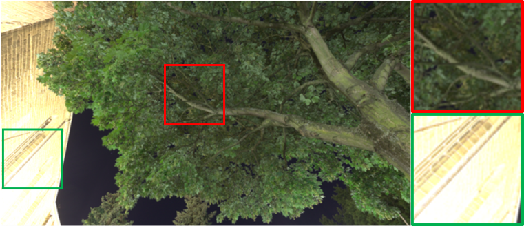
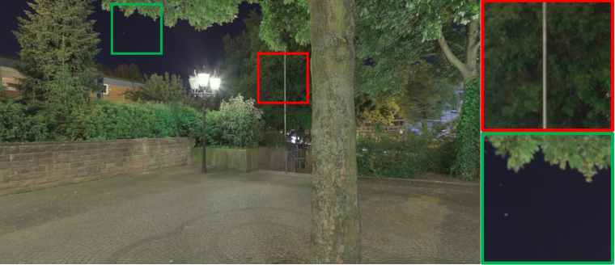
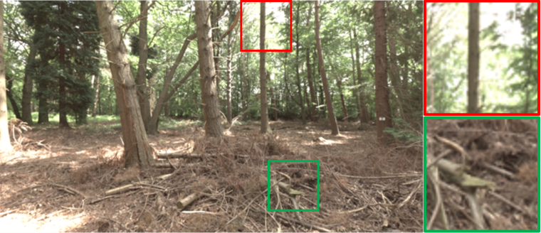
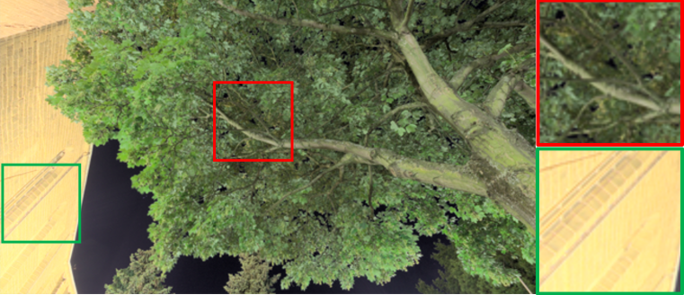
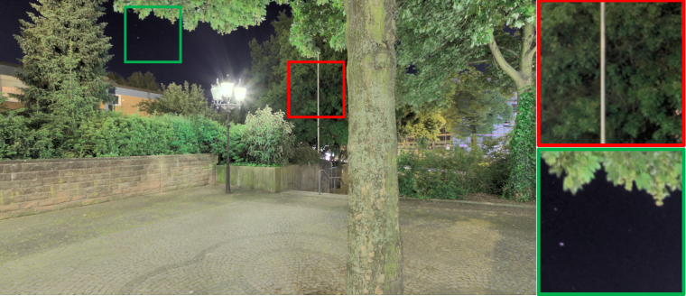
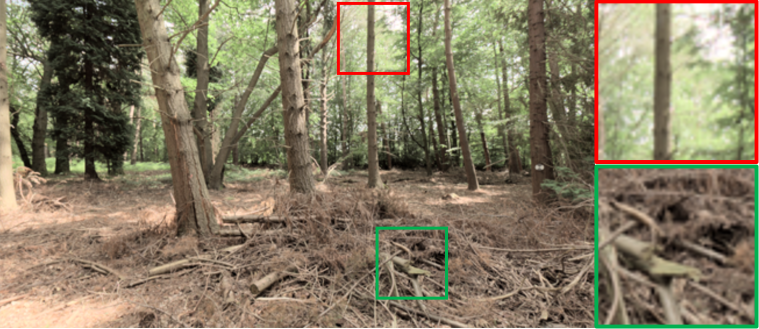

# HMD-TMO

Unity project of [HMD-TMO: A Tone Mapping Operator for 360° HDR Images Visualization for Head Mounted Displays](https://hal.archives-ouvertes.fr/hal-02301430).

> "HMD-TMO: A Tone Mapping Operator for 360 HDR Images Visualization for Head Mounted Displays; I. Goudé, R. Cozot, F. Banterle; Computer Graphics International Conference (2019), 216-227; https://doi.org/10.1007/978-3-030-22514-8_18"

Extended in TCS journal: [A Perceptually Coherent TMO for Visualization of 360° HDR Images on HMD](https://hal.archives-ouvertes.fr/hal-02912340)

> "A Perceptually Coherent TMO for Visualization of 360° HDR Images on HMD; I. Goudé, R. Cozot, O. Le Meur; Transactions on Computational Science XXXVII (2020), 109-128; https://doi.org/10.1007/978-3-662-61983-4_7"

## Requirements

Unity 2019.1.8f1  
SteamVR (up to date)  
This TMO has been developed using a HTC Vive pro HMD.

## TMO Framework

<html>
    <body>
        

    </body>
</html>

Our operator combines a Global TMO G(Lw) and a Viewport TMO V(Lw,t).  
The Global TMO (upper branch) aims to preserve the global coherency of the scene while the Viewport TMO (lower branch) aims to enhances contrast.  
The combination of both produces our final HMD-TMO Ld(G,V ).

## Dataset

The dataset used to compute the TMQI quality scores of our method compared with three other TMOs.  
90 viewport images: 15 views from six different 360° HDR images including:
  * HDR viewport  
  * Tone mapped viewport  
    * [Reinhard et al. 2002](https://dl.acm.org/doi/abs/10.1145/566570.566575)    
    * [Ward et al. 1997](https://ieeexplore.ieee.org/abstract/document/646233)  
    * [Yu 2015](https://pdfs.semanticscholar.org/4dfd/c1708674cfe8b6e388ead904a5cb54d236dd.pdf)  
    * Our HMD-TMO  

The link to download the dataset is coming soon...

## Results

<html>
    <body>
        

            
            
              
            
            
            
        

    </body>
</html>

[Yu’s TMO](https://pdfs.semanticscholar.org/4dfd/c1708674cfe8b6e388ead904a5cb54d236dd.pdf) (top) compared with our HMD-TMO (bottom).  
Our method enhances fine details and removes the clipping in high luminance.

## Contact

> Ific Goudé  
Research Scientist in Computer Graphics  
Email: goude.ific@gmail.com  
Website: [https://igoude.github.io/](https://igoude.github.io/)
